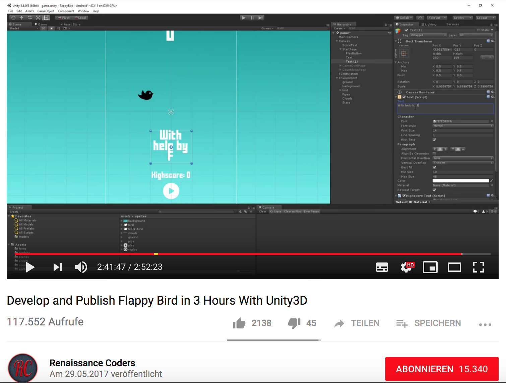

# FlappyBird

Developed on MacOS High Sierra with Unity Version 2018.2.12f1.

Desc: A player has to lead the bird through the rails without touching them. To do so, the player has to click on the mouse to get the bird higher. The bird flys lower all the time, so the player has to click the mousepad in order to fly with the bird.
------

### Game Tutorial:

[link for tutorial](https://www.youtube.com/watch?v=A-GkNM8M5p8)

# sources
[link for donald trump pic](https://www.clipartmax.com/middle/m2i8d3K9Z5Z5A0i8_free-clipart-of-donald-trump-waving-impeachment-all-the-reasons-donald-trump/)

----
